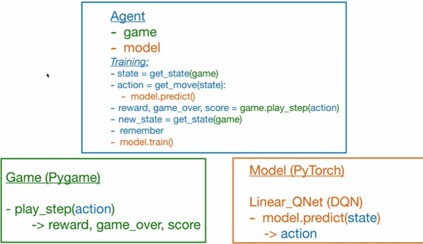
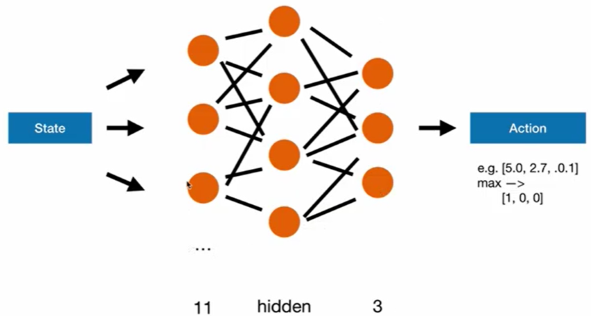
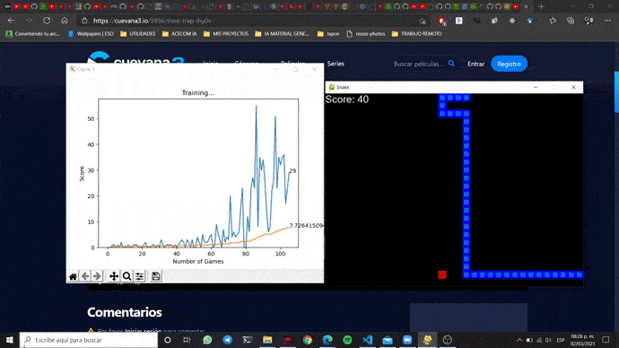

<h2 align="center">
<p>Snake with PyTorch 🔥</p>
</h2>

## 🐍 Modules
Much of this work was inspired by [this](https://youtu.be/PJl4iabBEz0) tutorials. The agent will learn to find the right way to get to his reward (food); to do this, it will use DQN techniques, which combine Bellman's equations and neural networks for estimating the Q values.


The agent was built with PyTorch, while the game environment was built with PyGame (if you want you can opt for GYM).

The application modules are shown below.

<p align="center">
  
  <p align="center">Modules of the application</p>
</p>

## 🧠 Model
The architecture used was a feedforward network (very simple). The network receives a vector of states (11 in total) and generates a prediction that will indicate the next direction that the agent should take (no turn, left, right). 

Part of the network code is shown below.

```python
class LinearQNet(nn.Module):
    def __init__(self, input_size, hidden_size, output_size):
        super().__init__()
        self.linear1 = nn.Linear(input_size, hidden_size)
        self.linear2 = nn.Linear(hidden_size, output_size)

    def forward(self, x):
        x = F.relu(self.linear1(x))
        x = self.linear2(x)
        return x
```

<p align="center">
  
  <p align="center">Architecture of the neural network</p>
</p>

## ▶ Demo

If you want to run application, simply install all the dependencies of the *requirements.txt* and execute the following line.

```bash
python agent.py
```

Two windows will open immediately, as shown below.

<p align="center">
  
</p>

## 👨‍💻 Maintainers
* Cristhian Wiki, Github: [HiroForYou](https://github.com/HiroForYou) Email: csanchezs@uni.pe